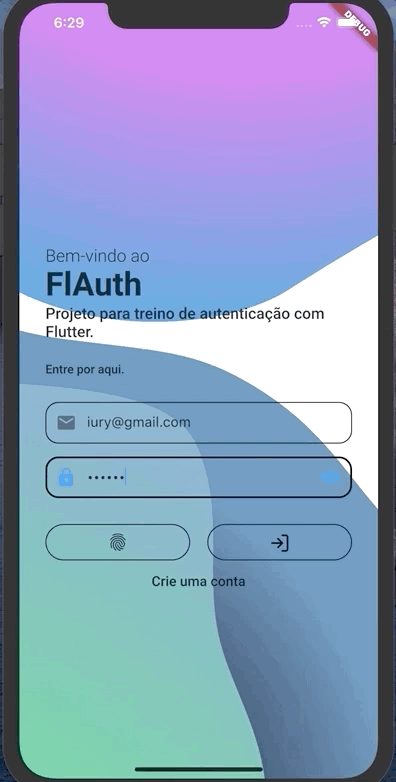

<h1 align="center"></h1>
<p align="center">FlAuth</p>
<p align="center">
  <a href="https://flutter.dev/">
    
  </a>
  <a href="https://nodejs.org/en/">
    
  </a>
</p>
<p align="center"></p>
<p align="center"></p>
<p align="center"></p>

---

## About

Um app padrão para estudar autenticação, flare e animações.

### Technologies

<ul>
    <li>Flutter</li>
    <li>NodeJs</li>
    <li>Typescript</li>
</ul>

## Installation

## Development setup

Clone Project

```git
git clone https://github.com/iury0393/authentication_node_flutter
cd authentication_node_flutter
```

API

```ssh
cd backend
yarn
yarn typeorm migrattion:run
yarn dev:server
```

Mobile

```ssh
cd mobile
pub get
start the application
```

## Author

## Iury Vasconcelos Leitão - [GitHub](https://github.com/iury0393) / [Linkedin](https://www.linkedin.com/in/iury-vasconcelos-dev/) / [Email](mailto:iury0393@gmail.com)

Distributed under the MIT license. See `LICENSE` for more information.

## Contributing

1. Fork it (<https://github.com/iury0393/authentication_node_flutter/fork>)
2. Create your feature branch (`git checkout -b feature/`)
3. Commit your changes (`git commit -am 'Add something'`)
4. Push to the branch (`git push origin feature/`)
5. Create a new Pull Request

<p align="center">Develop by <a href="https://github.com/iury0393">Iury Vasconcelos</a></p>
